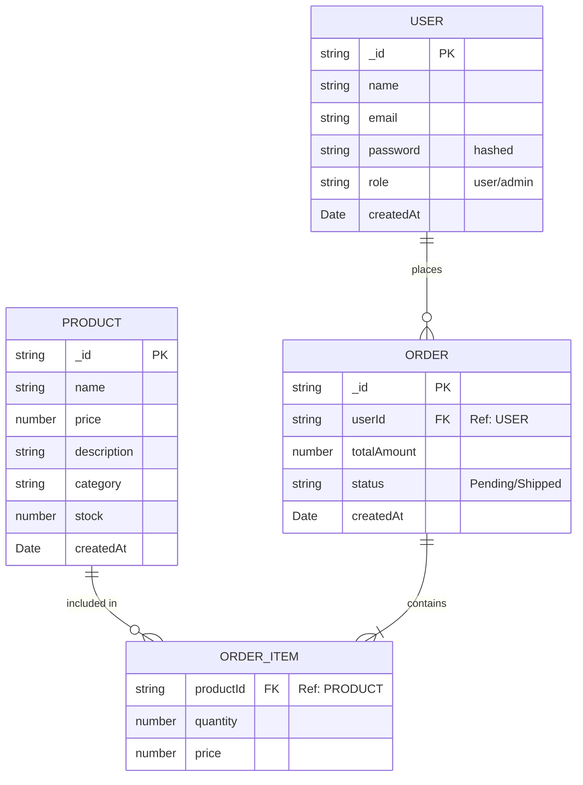

# E-Commerce Architecture - Entity Relationship (ER) Diagram

A high-level overview of how data entities map to each other in the NoSQL architecture inside Mongoose.

```mermaid
erDiagram
    USER ||--o{ ORDER : places
    USER {
        string _id PK
        string name
        string email
        string password "hashed"
        string role "user/admin"
        Date createdAt
    }

    PRODUCT ||--o{ ORDER_ITEM : "included in"
    PRODUCT {
        string _id PK
        string name
        number price
        string description
        string category
        number stock
        Date createdAt
    }

    ORDER {
        string _id PK
        string userId FK "Ref: USER"
        number totalAmount
        string status "Pending/Shipped"
        Date createdAt
    }

    ORDER_ITEM {
        string productId FK "Ref: PRODUCT"
        number quantity
        number price
    }

    ORDER ||--|{ ORDER_ITEM : contains
```
