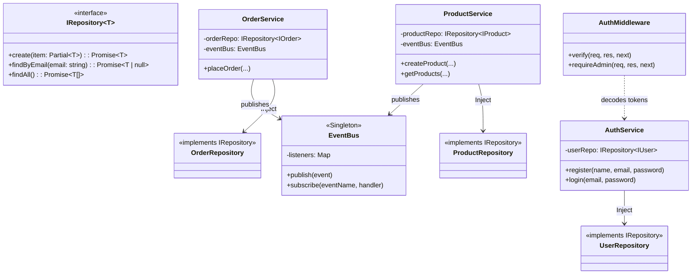

# E-Commerce Architecture - Class Diagram

This Class Diagram focuses distinctly on the **Design Patterns** (Dependency Inversion and Repositories) backing the software topology.

```mermaid
classDiagram
    class IRepository~T~ {
        <<interface>>
        +create(item: Partial~T~): Promise~T~
        +findByEmail(email: string): Promise~T | null~
        +findAll(): Promise~T[]~
    }

    class EventBus {
        <<Singleton>>
        -listeners: Map
        +publish(event)
        +subscribe(eventName, handler)
    }

    class AuthMiddleware {
        +verify(req, res, next)
        +requireAdmin(req, res, next)
    }

    class AuthService {
        -userRepo: IRepository~IUser~
        +register(name, email, password)
        +login(email, password)
    }

    class UserRepository {
        <<implements IRepository>>
    }

    class ProductService {
        -productRepo: IRepository~IProduct~
        -eventBus: EventBus
        +createProduct(...)
        +getProducts(...)
    }

    class ProductRepository {
        <<implements IRepository>>
    }
    
    class OrderService {
        -orderRepo: IRepository~IOrder~
        -eventBus: EventBus
        +placeOrder(...)
    }

    class OrderRepository {
        <<implements IRepository>>
    }

    %% Relationships
    AuthService --> UserRepository : Inject
    ProductService --> ProductRepository : Inject
    OrderService --> OrderRepository : Inject

    ProductService --> EventBus : publishes
    OrderService --> EventBus : publishes
    AuthMiddleware ..> AuthService : decodes tokens
```
