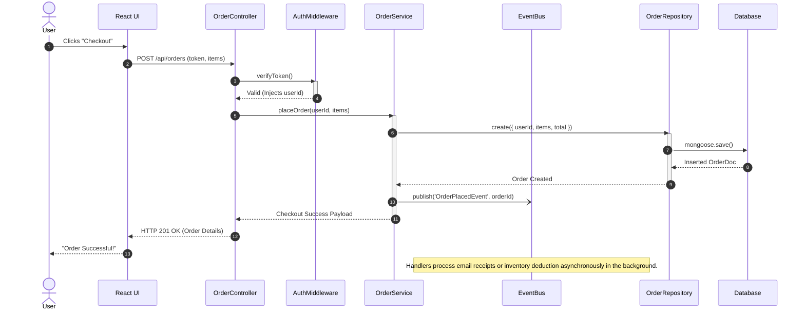

# E-Commerce Architecture - Sequence Diagram

This Sequence Diagram maps out the complex, end-to-end data flow that fires asynchronously when a user places a checkout order. 

Notice how the `OrderService` delegates background processing to the `EventBus` to prevent hanging the initial HTTP response thread.

