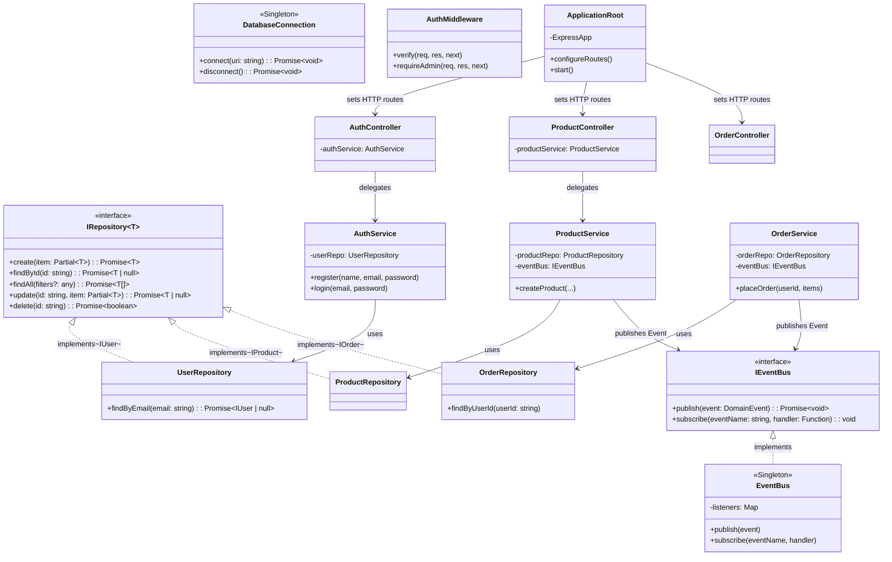

# E-Commerce Architecture Diagram

## Mermaid Diagram

You can also view this architecture right now! Just drop this Mermaid code into a tool like [Mermaid Live Editor](https://mermaid.live/), or use it in GitHub markdown files directly.

